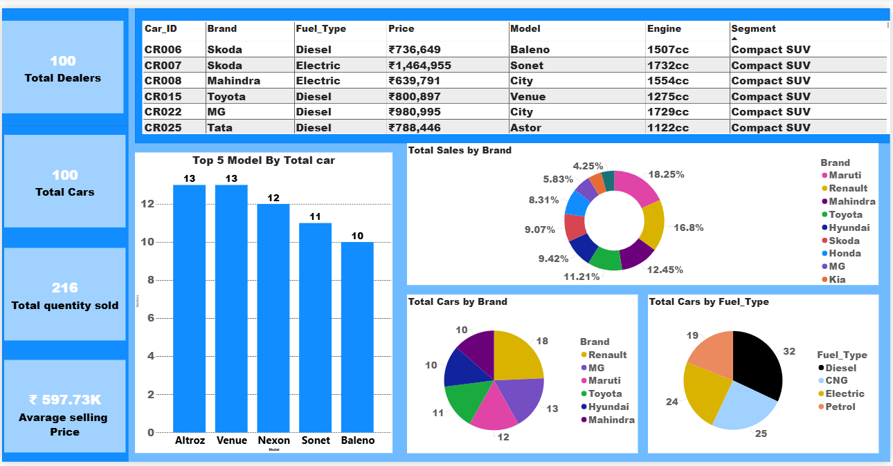

# 🚗 Car Sales Analysis Dashboard | Power BI

## 📌 Project Overview
This project is an **interactive Car Sales Analysis Dashboard** built using
**Power BI**. It provides insights into **sales performance, customer behavior,
brand-wise sales, fuel type distribution, and regional trends** to support
data-driven decision-making.

---

## 📷 Dashboard Preview

### 🔹 Car Sales Dashboard

**Description:**  
This dashboard provides a high-level overview of overall car sales performance.
It highlights key business KPIs such as **Total Sales, Total Customers,
Average Monthly Sales, and Total Quantity Sold**.

**Insights:**
- Total sales reached **₹129M**, indicating strong overall performance
- **216 cars sold** across multiple cities
- Top 5 cities contribute the majority of total revenue
- Gender-wise customer distribution helps understand buyer demographics

  
### 🔹 Car Details & Brand Analysis

**Description:**  
This dashboard focuses on **brand, model, and fuel-type analysis** to understand
product-level performance and customer preferences.

**Insights:**
- Identifies **top-selling car models** such as Altroz, Venue, and Nexon
- Shows **brand-wise contribution** to total sales
- Fuel type analysis highlights demand for **Diesel, Petrol, CNG, and Electric**
- Helps optimize inventory and brand-level sales strategies

  
### 🔹 Customer Performance Dashboard

**Description:**  
This dashboard analyzes **customer behavior and regional sales performance**
to identify high-value customers and profitable regions.

**Insights:**
- Highlights **top 5 customers by revenue**
- Shows state-wise sales contribution (Rajasthan, Punjab, Telangana, etc.)
- Tracks **monthly sales trends** to identify peak and low-performing months
- Supports targeted marketing and customer retention strategies

## 📈 Dashboard Insights

### 1️⃣ Top Cities by Sales
Identifies the top 5 cities contributing the highest revenue, helping focus
sales and marketing strategies.

### 2️⃣ Brand-wise Sales Analysis
Shows contribution of brands like **Maruti, Hyundai, Toyota, Tata, Mahindra**
to total sales.

### 3️⃣ Fuel Type Distribution
Analyzes customer preference across **Diesel, Petrol, CNG, and Electric**
vehicles.

### 4️⃣ Customer Demographics
Breakdown of total customers by **gender**, providing insights into buyer
behavior.

### 5️⃣ Monthly Sales Trend
Tracks sales variation across months to identify peak and low sales periods.

### 6️⃣ Top Models by Quantity Sold
Highlights high-demand car models such as **Altroz, Venue, Nexon, Sonet,
Baleno**.

## 🛠 Tools & Technologies Used
- Power BI
- DAX
- Power Query
- Data Modeling
- Data Cleaning
- Data Visualization
- Business Analytics

---

## 🎯 Business Value
- Helps management identify **top-performing brands and cities**
- Supports **inventory planning** based on demand
- Improves **customer targeting strategies**
- Enables **sales trend forecasting**

---

## 👨‍💻 About Me
**Tushar Vala**  
Aspiring Data Analyst | Fresher  

📧 Email: tusharvala707@gmail.com  
🌐 Portfolio: https://tushars-tech-canvas.lovable.app/

---

⭐ If you find this project useful, feel free to **star the repository**!
